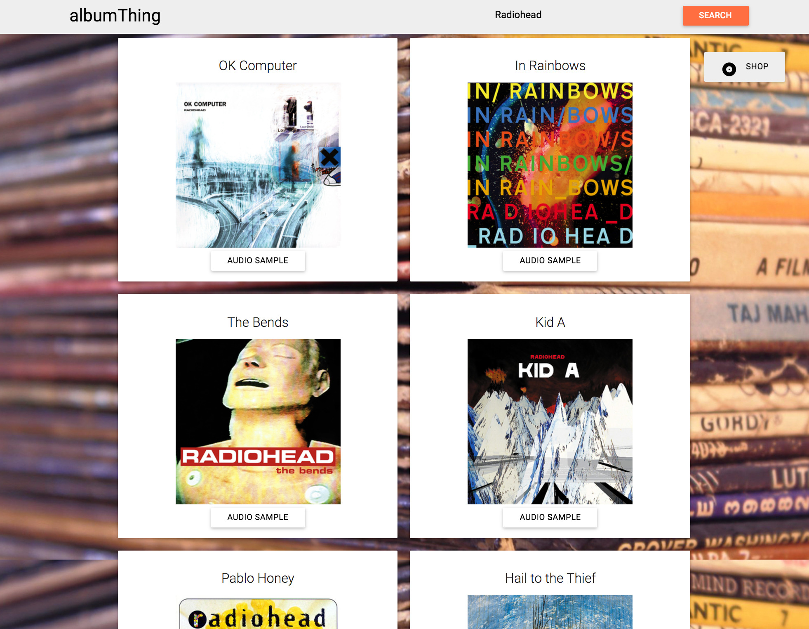

# albumThing

albumThing is the first web application I built, which I submitted as my first quarter project during Galvanize Web Development Immersive.

albumThing is visual discography that pulls album data with audio samples based on artist search parameters.

Technologies used: JS/HTML/CSS, Materialize, Ajax, jQuery and APIs (LastFM and Spotify).

